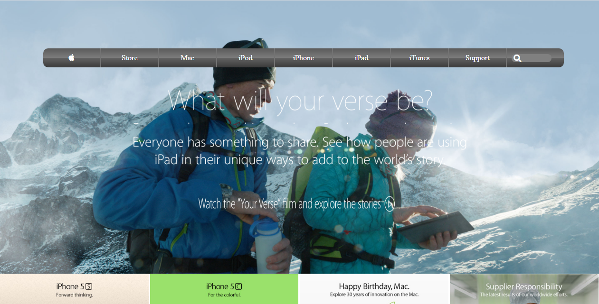
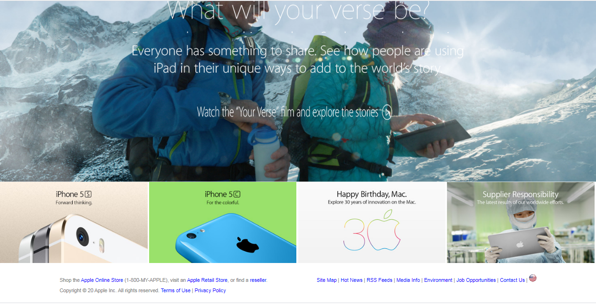

 

# web-page-apple

## What it does
Building a web page that is similar to the former apple web page

## Screenshots

### Screenshot 1

### Screenshot 2

## Built With
- HTML
- CSS
#### and deployed to Github

## Live Demo

[Live Demo]

## Getting Started

To get a local copy up and running follow these simple example steps.
- Clone the project unto your local machine
- `cd` into the project directory
- Open up index.html in your browser to view the project

## Author

## Authors

👤  **Theophile Kango**

- Github: [@githubhandle](https://github.com/Theophile-Kango)
- Twitter: [@twitterhandle](https://twitter.com/Theophadh)
- Linkedin: [linkedin](https://www.linkedin.com/in/theophile-kango)

## 🤝 Contributing

Feel free to check the [issues page](https://github.com/Buyaki01/signUpForm/issues).

## Show your support

Give a ⭐️ if you like this project!

## 📝 License

This project is licensed by Microverse.

### Enjoy!
